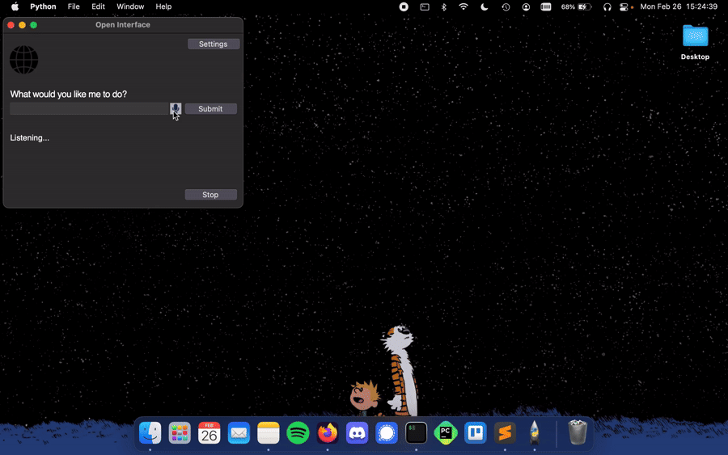
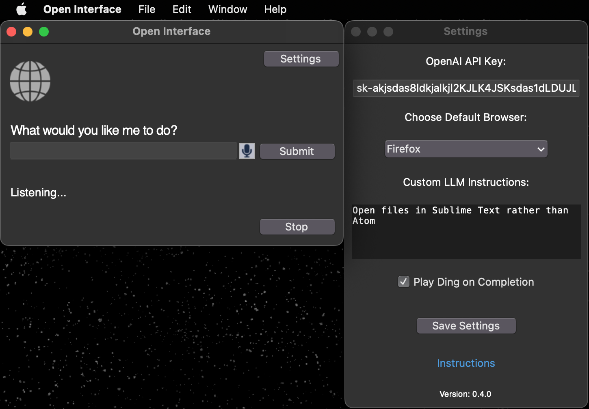
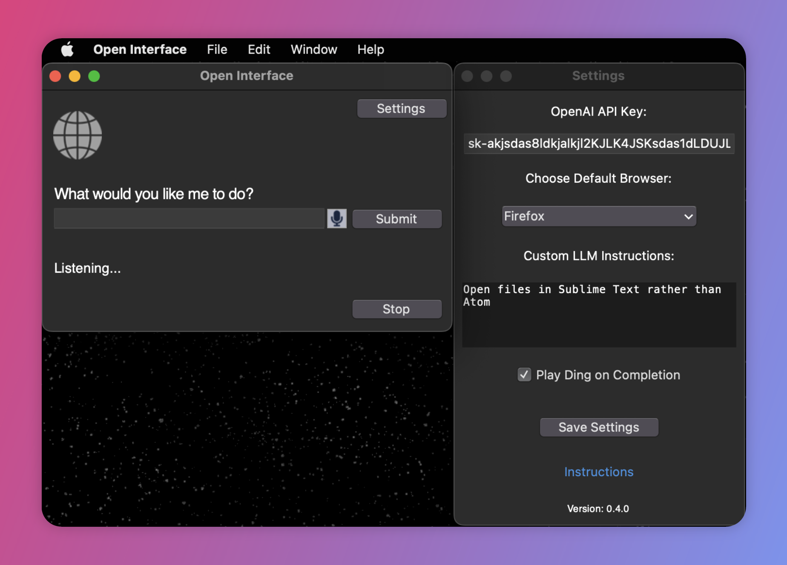
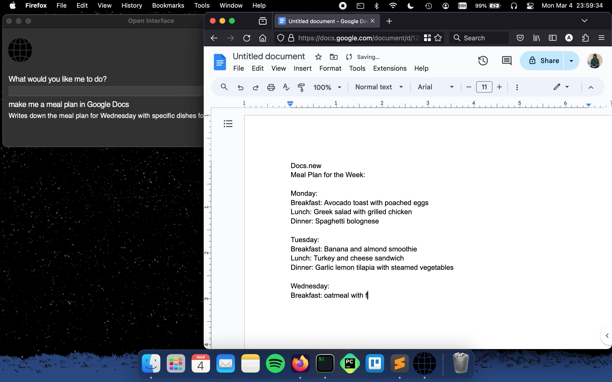
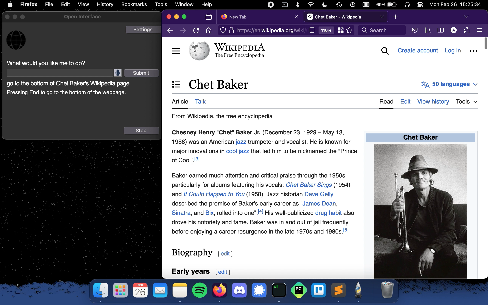

# Open Interface Demos and Media Resources

This document is an extension of [README.md](README.md) which I recommend to check out first.

Feel free to use these images and videos in publication and reach out to me for any questions.

Sections
- [Demo Videos](https://github.com/AmberSahdev/Open-Interface/blob/main/MEDIA.md#demos)
- [Images](https://github.com/AmberSahdev/Open-Interface/blob/main/MEDIA.md#images)

## Demos

### "Write a Web App"

https://github.com/AmberSahdev/Open-Interface/assets/23853621/956ac674-2c70-4011-9aad-50bd338b2674

### "Go to the Bottom of Chet Baker's Wikiedia Page"

https://github.com/AmberSahdev/Open-Interface/assets/23853621/bf9041b8-3c14-407f-8a72-1cddd7bc6ff9

### "Make me a meal plan in Google Docs"

https://github.com/AmberSahdev/Open-Interface/assets/23853621/424f61ad-5ee6-425f-b922-a1eecad2ef7b

---

## Images:

UI and Custom LLM Models:

Old UI:

<!-- -->

Making a Web App:

Writing a Meal Plan:

Navigating Wikipedia:

