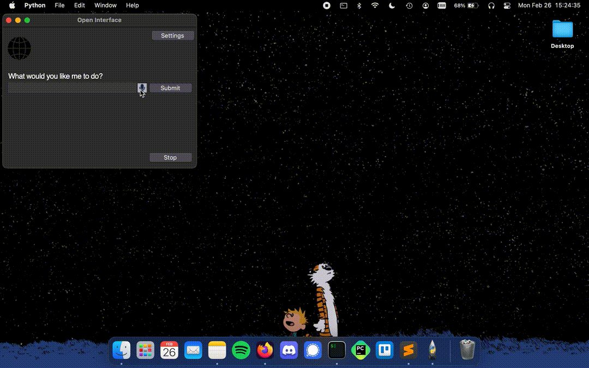

# Open Interface Demos and Media

This document is an extension of [README.md](README.md) which I recommend to check out first.

### "Write a Web App"

### "Go to the Bottom of Chet Baker's Wikiedia Page"

### "Make me a meal plan in Google Docs"

---

### UI:

