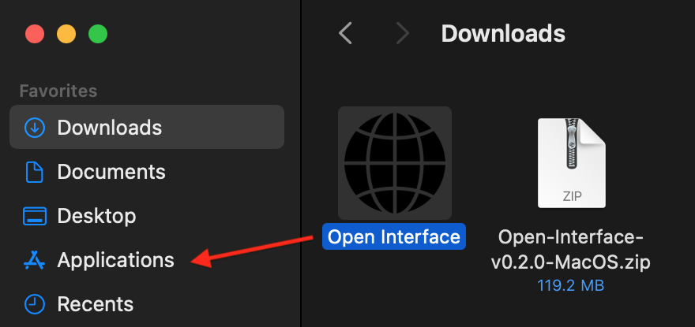
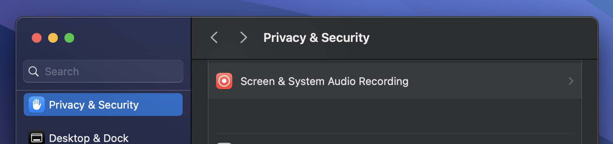
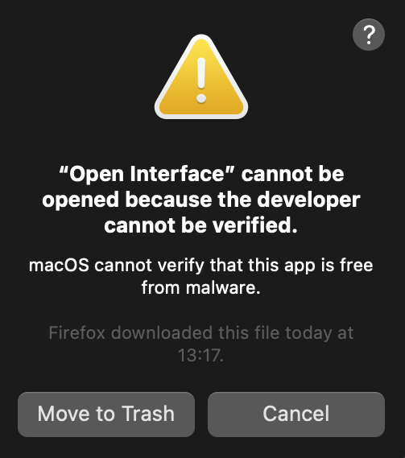
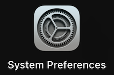
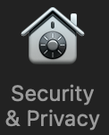
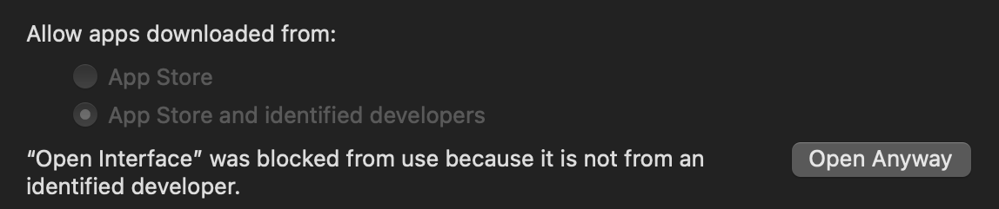
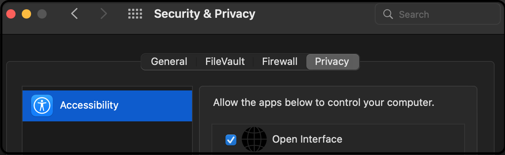
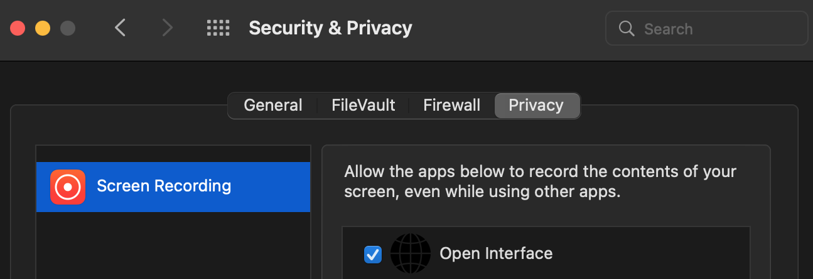
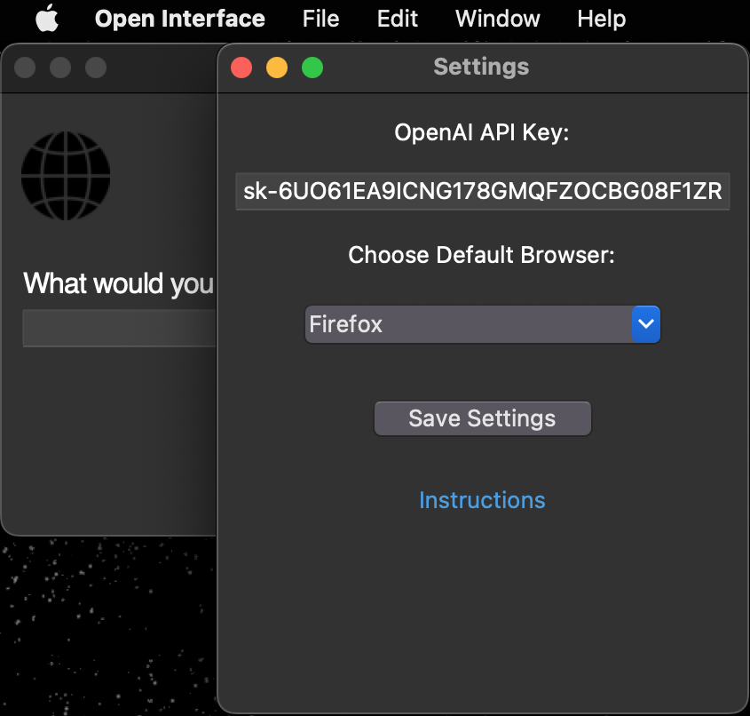
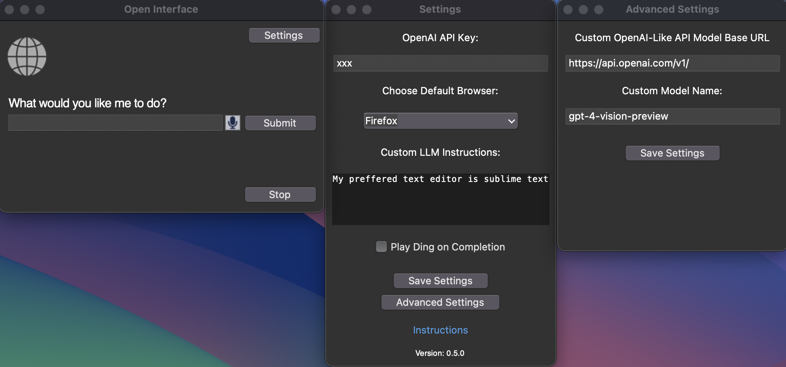

# Open Interface

<picture>
	
</picture>

### Full Autopilot for All Computers Using LLMs

Open Interface
- Self-drives computers by sending user requests to an LLM backend (GPT-4V, etc) to figure out the required steps.
- Automatically executes the steps by simulating keyboard and mouse input.
- Course-corrects by sending the LLMs a current screenshot of the computer as needed. 


<div align="center">
<h4>Self-Driving Software for All Your Computers</h4>

  [](https://github.com/AmberSahdev/Open-Interface?tab=readme-ov-file#install)
  [](https://github.com/AmberSahdev/Open-Interface?tab=readme-ov-file#install)
  [](https://github.com/AmberSahdev/Open-Interface?tab=readme-ov-file#install)
  <br>
  []((https://github.com/AmberSahdev/Open-Interface/releases/latest))
  
  
   
  [](https://github.com/AmberSahdev/Open-Interface/releases/latest)

</div>

### <ins>Demo</ins> 💻
["Make me a meal plan in Google Docs"]<br>
<br>
[More Demos](https://github.com/AmberSahdev/Open-Interface/blob/main/MEDIA.md#demos)


<hr>

### <ins>Install</ins> 💽
<details>
    <summary> <b>MacOS</b></summary>
    <ul>
        <li>Download the MacOS binary from the latest <a href="https://github.com/AmberSahdev/Open-Interface/releases/latest">release</a>.</li>
        <li>Unzip the file and move Open Interface to the Applications Folder.<br><br> 
            
        </li>
    </ul>
  <details>
    <summary><b>M-Series Macs</b></summary>
    <ul>
      <li>
        Open Interface will ask you for Accessibility access to operate your keyboard and mouse for you, and Screen Recording access to take screenshots to assess its progress.<br>
      </li>
      <li>
        In case it doesn't, manually add these permission via <b>System Settings</b> -> <b>Privacy and Security</b>
        <br>
        <br>
        
      </li>
    </ul>
  </details>
  <details>
    <summary><b>Intel Macs</b></summary>
    <ul>
        <li>
            Launch the app from the Applications folder.<br>
            You might face the standard Mac <i>"Open Interface cannot be opened" error</i>.<br><br>
            <br>
            In that case, press <b><i><ins>"Cancel"</ins></i></b>.<br>
            Then go to <b>System Preferences -> Security and Privacy -> Open Anyway.</b><br><br>
             &nbsp; 
             &nbsp;
             
        </li>
        <br>
        <li>
        Open Interface will also need Accessibility access to operate your keyboard and mouse for you, and Screen Recording access to take screenshots to assess its progress.<br><br>
        <br>
        
        </li>
      </ul>
</details>
      <ul>
        <li>Lastly, checkout the <a href="#setup">Setup</a> section to connect Open Interface to LLMs (OpenAI GPT-4V)</li>
    </ul>
</details>
<details>
    <summary> <b>Linux</b></summary>
    <ul>
        <li>Linux binary has been tested on Ubuntu 20.04 so far.</li>
        <li>Download the Linux zip file from the latest <a href="https://github.com/AmberSahdev/Open-Interface/releases/latest">release</a>.</li>
        <li>
            Extract the executable and run it from the Terminal via <br>
            <code>./Open\ Interface</code>
        </li>
	<li>Checkout the <a href="https://github.com/AmberSahdev/Open-Interface?tab=readme-ov-file#setup">Setup</a> section to connect Open Interface to LLMs (OpenAI GPT-4V)</li>
    </ul>
</details>
<details>
    <summary> <b>Windows</b></summary>
    <ul>
	<li>Windows binary has been tested on Windows 10.</li>
	<li>Download the Windows zip file from the latest <a href="https://github.com/AmberSahdev/Open-Interface/releases/latest">release</a>.</li>
	<li>Unzip the folder, move the exe to the desired location, double click to open, and voila.</li>
	<li>Checkout the <a href="https://github.com/AmberSahdev/Open-Interface?tab=readme-ov-file#setup">Setup</a> section to connect Open Interface to LLMs (OpenAI GPT-4V)</li>
    </ul>
</details>


### <ins id="setup">Setup</ins> 🛠️
<details>
    <summary><b>Set up the OpenAI API key</b></summary>

- Get your OpenAI API key
  - Open Interface needs access to GPT-4V to perform user requests. GPT-4V keys can be downloaded from your [OpenAI account](https://platform.openai.com/).
  - [Follow the steps here](https://help.openai.com/en/articles/8264644-what-is-prepaid-billing) to add balance to your OpenAI account. To unlock GPT-4V a minimum payment of $5 is needed.
  - [More info](https://help.openai.com/en/articles/7102672-how-can-i-access-gpt-4)
- Save the API key in Open Interface settings
  - In Open Interface, go to the Settings menu on the top right and enter the key you received from OpenAI into the text field like so: <br>
  <br>
  <picture>
	
  </picture><br>
  <br>

- After setting the API key for the first time you'll need to restart the app.

</details>

<details>
    <summary><b>Optional: Setup a Custom LLM</b></summary>

- Open Interface supports using other OpenAI API style LLMs (such as Llava) as a backend and can be configured easily in the Advanced Settings window.
- Enter the custom base url and model name in the Advanced Settings window and the API key in the Settings window as needed.
  <br>
  <picture>
	
  </picture><br>
  <br>
- If your LLM does not support an OpenAI style API, you can use a library like [this](https://github.com/BerriAI/litellm) to convert it to one.
- You will need to restart the app after these changes.

</details>

<hr>

### <ins>Stuff It’s Bad At (For Now)</ins> 😬

- Accurate spatial-reasoning and hence clicking buttons.
- Keeping track of itself in tabular contexts, like Excel and Google Sheets, for similar reasons as stated above.
- Navigating complex GUI-rich applications like Counter-Strike, Spotify, Garage Band, etc due to heavy reliance on cursor actions.


### <ins>Future</ins> 🔮
(*with better models trained on video walkthroughs like Youtube tutorials*)
- "Create a couple of bass samples for me in Garage Band for my latest project."
- "Read this design document for a new feature, edit the code on Github, and submit it for review."
- "Find my friends' music taste from Spotify and create a party playlist for tonight's event."
- "Take the pictures from my Tahoe trip and make a White Lotus type montage in iMovie."

### <ins>Notes</ins> 📝
- Cost: $0.05 - $0.20 per user request.<br>
(This will be much lower in the near future once GPT-4V enables assistant/stateful mode)
- You can interrupt the app anytime by pressing the Stop button, or by dragging your cursor to any of the screen corners.
- Open Interface can only see your primary display when using multiple monitors. Therefore, if the cursor/focus is on a secondary screen, it might keep retrying the same actions as it is unable to see its progress (especially in MacOS with launching Spotlight).

<hr>

### <ins>System Diagram</ins> 🖼️
```
+----------------------------------------------------+
| App                                                |
|                                                    |
|    +-------+                                       |
|    |  GUI  |                                       |
|    +-------+                                       |
|        ^                                           |
|        |                                           |
|        v                                           |
|  +-----------+  (Screenshot + Goal)  +-----------+ |
|  |           | --------------------> |           | |
|  |    Core   |                       |    LLM    | |
|  |           | <-------------------- |  (GPT-4V) | |
|  +-----------+    (Instructions)     +-----------+ |
|        |                                           |
|        v                                           |
|  +-------------+                                   |
|  | Interpreter |                                   |
|  +-------------+                                   |
|        |                                           |
|        v                                           |
|  +-------------+                                   |
|  |   Executer  |                                   |
|  +-------------+                                   |
+----------------------------------------------------+
```

--- 

## <ins>Star History</ins> ⭐️

<picture>
	
</picture>

### <ins>Links</ins> 🔗
- Check out more of my projects at [AmberSah.dev](https://AmberSah.dev).
- Other demos and press kit can be found at [MEDIA.md](MEDIA.md).
  
<div align="center">
	
	<!-- <br>
	-->
</div>