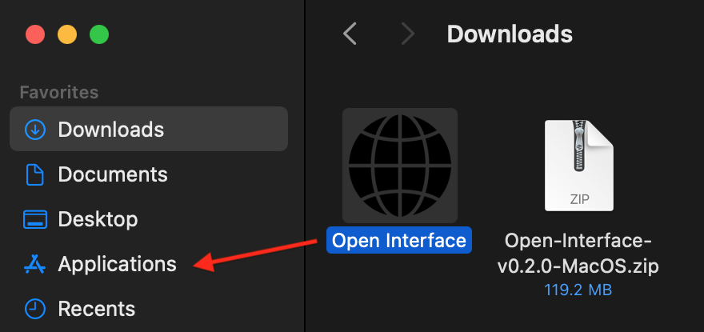
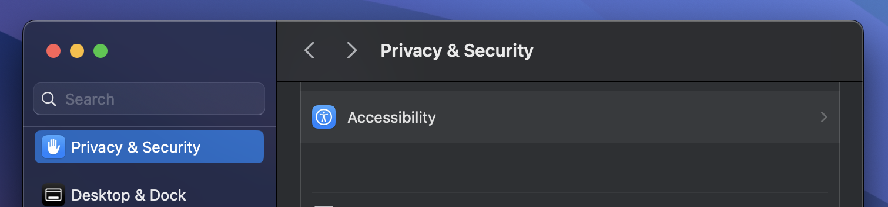
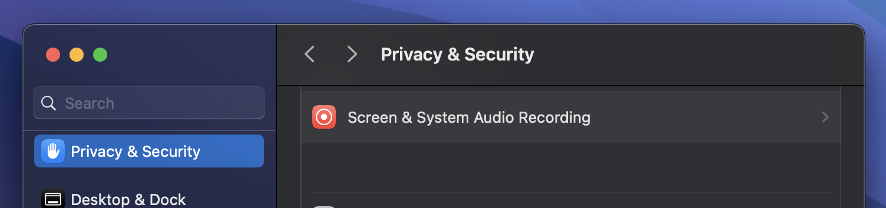
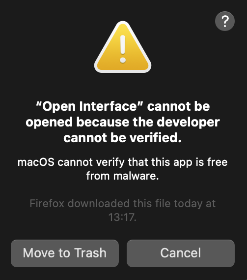
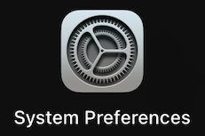
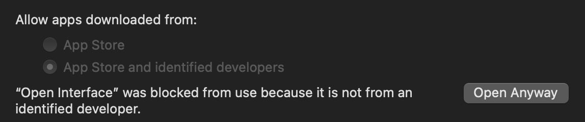
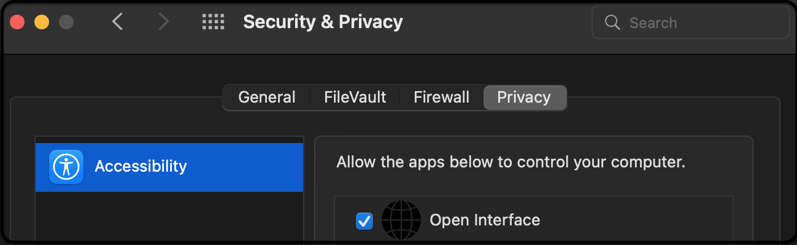
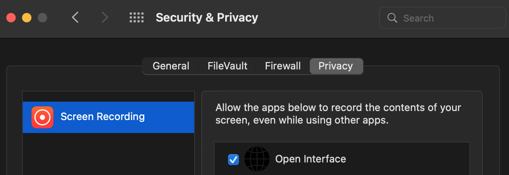
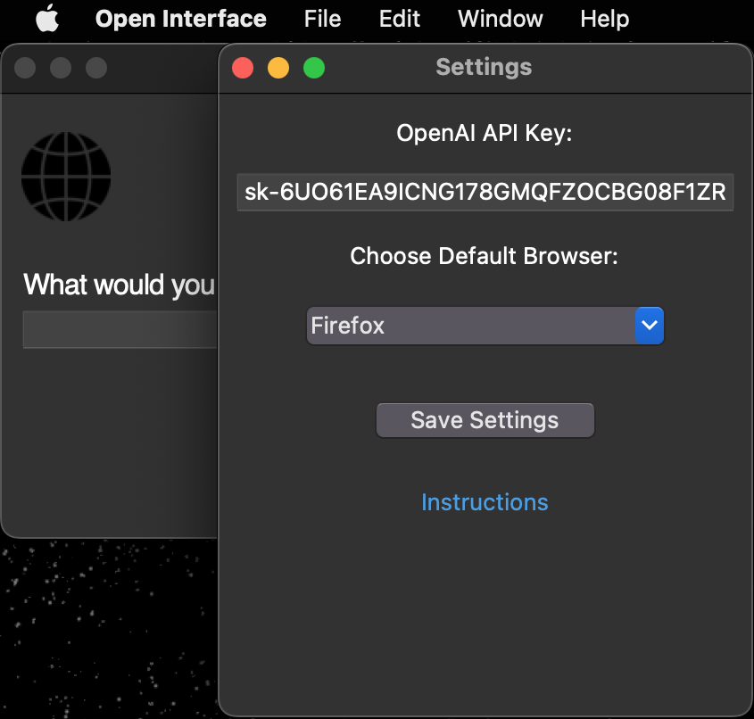
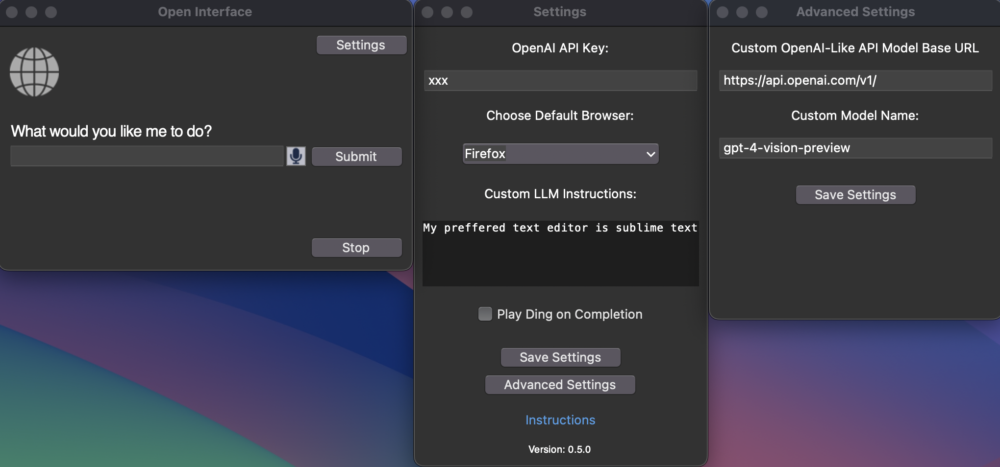

# Open Interface

<picture>
	
</picture>

### Control Your Computer Using LLMs

Open Interface
- Runs a screenshot-driven desktop agent loop powered by GPT-5, GPT-4o, GPT-4V, Gemini, Claude, Qwen, and compatible OpenAI-style endpoints.
- Asks the model for at most one next UI action at a time, then executes it with local keyboard and mouse control.
- Re-observes the screen after each step, optionally verifies visual change locally, and course-corrects until the task is done or safely stopped.


<div align="center">
<h4>Full Autopilot for All Computers Using LLMs</h4>

  [](https://github.com/AmberSahdev/Open-Interface?tab=readme-ov-file#install)
  [](https://github.com/AmberSahdev/Open-Interface?tab=readme-ov-file#install)
  [](https://github.com/AmberSahdev/Open-Interface?tab=readme-ov-file#install)
  <br>
  []((https://github.com/AmberSahdev/Open-Interface/releases/latest))
  
  
   
  [](https://github.com/AmberSahdev/Open-Interface/releases/latest)

</div>

### <ins>Demo</ins> 💻
"Solve Today's Wordle"<br>
<br>
*clipped, 2x*

<details>
    <summary><a href="https://github.com/AmberSahdev/Open-Interface/blob/main/MEDIA.md#demos">More Demos</a></summary>
    <ul>
	    <li>
		    "Make me a meal plan in Google Docs"
		    
	    </li>
	    <li>
		    "Write a Web App"
		    
	    </li>
    </ul>
</details>

<hr>

### <ins>Install</ins> 💽
<details>
    <summary> <b>MacOS</b></summary>
    <ul>
        <li>Download the MacOS binary from the latest <a href="https://github.com/AmberSahdev/Open-Interface/releases/latest">release</a>.</li>
        <li>Unzip the file and move Open Interface to the Applications Folder.<br><br> 
            
        </li>
    </ul>
  <details>
    <summary><b>Apple Silicon M-Series Macs</b></summary>
    <ul>
      <li>
        Open Interface will ask you for Accessibility access to operate your keyboard and mouse for you, and Screen Recording access to take screenshots to assess its progress.<br>
      </li>
      <li>
        In case it doesn't, manually add these permission via <b>System Settings</b> -> <b>Privacy and Security</b>
        <br>
        <br>
        
      </li>
    </ul>
  </details>
  <details>
    <summary><b>Intel Macs</b></summary>
    <ul>
        <li>
            Launch the app from the Applications folder.<br>
            You might face the standard Mac <i>"Open Interface cannot be opened" error</i>.<br><br>
            <br>
            In that case, press <b><i><ins>"Cancel"</ins></i></b>.<br>
            Then go to <b>System Preferences -> Security and Privacy -> Open Anyway.</b><br><br>
             &nbsp; 
             &nbsp;
             
        </li>
        <br>
        <li>
        Open Interface will also need Accessibility access to operate your keyboard and mouse for you, and Screen Recording access to take screenshots to assess its progress.<br><br>
        <br>
        
        </li>
      </ul>
</details>
      <ul>
        <li>Lastly, checkout the <a href="#setup">Setup</a> section to connect Open Interface to your preferred LLM provider.</li>
    </ul>
</details>
<details>
    <summary> <b>Linux</b></summary>
    <ul>
        <li>Linux binary has been tested on Ubuntu 20.04 so far.</li>
        <li>Download the Linux zip file from the latest <a href="https://github.com/AmberSahdev/Open-Interface/releases/latest">release</a>.</li>
        <li>
            Extract the executable and checkout the <a href="https://github.com/AmberSahdev/Open-Interface?tab=readme-ov-file#setup">Setup</a> section to connect Open Interface to LLMs such as GPT-5, GPT-4o, Gemini, Claude, or Qwen.</li>
    </ul>
</details>
<details>
    <summary> <b>Windows</b></summary>
    <ul>
	<li>Windows binary has been tested on Windows 10.</li>
	<li>Download the Windows zip file from the latest <a href="https://github.com/AmberSahdev/Open-Interface/releases/latest">release</a>.</li>
	<li>Unzip the folder, move the exe to the desired location, double click to open, and voila.</li>
	<li>Checkout the <a href="https://github.com/AmberSahdev/Open-Interface?tab=readme-ov-file#setup">Setup</a> section to connect Open Interface to your preferred LLM provider.</li>
    </ul>
</details>

<details>
    <summary> <b>Run as a Script</b></summary>
    <ul>
	  <li>Clone the repo <code>git clone https://github.com/AmberSahdev/Open-Interface.git</code></li>
      <li>Enter the directory <code>cd Open-Interface</code></li>
      <li><b>Optionally</b> use a Python virtual environment 
        <ul>
          <li>Note: pyenv handles tkinter installation weirdly so you may have to debug for your own system yourself.</li>
          <li><code>pyenv local 3.12.2</code></li>
          <li><code>python -m venv .venv</code></li> 
          <li><code>source .venv/bin/activate</code></li>
        </ul>
      </li>
      <li>Install dependencies <code>pip install -r requirements.txt</code></li>
      <li>Run the app using <code>python app/app.py</code></li>
    </ul>
</details>

### <ins id="setup">Setup</ins> 🛠️
<details>
    <summary><b>Set up the OpenAI API key</b></summary>

- Get your OpenAI API key
  - Open Interface can use OpenAI-compatible models including GPT-4o, GPT-4V, GPT-5, and `computer-use-preview` depending on your configuration. OpenAI keys can be downloaded from your OpenAI account at [platform.openai.com/settings/organization/api-keys](https://platform.openai.com/settings/organization/api-keys).
  - [Follow the steps here](https://help.openai.com/en/articles/8264644-what-is-prepaid-billing) to add balance to your OpenAI account. Some higher-tier models may require prepaid billing or additional account access.
  - [More info](https://help.openai.com/en/articles/7102672-how-can-i-access-gpt-4)
- Save the API key in Open Interface settings
  - In Open Interface, go to the Settings menu on the top right and enter the key you received from OpenAI into the text field like so: <br>
  <br>
  <picture>
	
  </picture><br>
  <br>

- After setting the API key for the first time you'll need to <b>restart the app</b>.

</details>

<details>
    <summary><b>Set up the Google Gemini API key</b></summary>

- Go to Settings -> Advanced Settings and select the Gemini model you wish to use.
- Get your Google Gemini API key from https://aistudio.google.com/app/apikey.
- Save the API key in Open Interface settings.
- Save the settings and <b>restart the app</b>.

</details>

<details>
    <summary><b>Optional: Setup a Custom LLM</b></summary>

- Open Interface supports using other OpenAI API style LLMs (such as Llava) as a backend and can be configured easily in the Advanced Settings window.
- Enter the custom base url and model name in the Advanced Settings window and the API key in the Settings window as needed. 
- NOTE - If you're using Llama:
  - You may need to enter a random string like "xxx" in the API key input box.
  - You may need to append /v1/ to the base URL.
    <br>
    <picture>
      
    </picture><br>
    <br>
- If your LLM does not support an OpenAI style API, you can use a library like [this](https://github.com/BerriAI/litellm) to convert it to one.
- You will need to restart the app after these changes.

</details>

<hr>

### <ins>Current Architecture</ins> 🧠

Open Interface now uses a structured request pipeline and Prompt System v1. The current app is still a strict single-step visual agent loop, but the prompt, history, and verification layers are more explicit and consistent than the earlier `context.txt + request_data JSON` approach.

- The runtime is a single-step closed loop, not a multi-step batch planner.
- Each model round may return multiple steps, but the runtime executes only the first executable one.
- `Core` creates a structured `request_context` for every request and persists messages plus execution logs through `SessionStore`.
- Most providers now share one prompt semantics source; provider adapters differ mainly in API message formatting.
- `computer-use-preview` is still a separate tool-driven path rather than the standard JSON step-output flow.

#### Request Flow

1. The UI sends the user's natural-language goal into a queue.
2. `App` forwards it to `Core.execute_user_request(...)` on a worker thread.
3. `Core` stops any previous request, snapshots the active session history, stores the new user message, and builds `request_context`.
4. `LLM` and the selected provider capture the latest screenshot and build a unified prompt package.
5. The model returns JSON with `steps` and `done`; the runtime keeps at most one step.
6. `Interpreter` executes the step locally and writes an execution log.
7. If local verification is enabled, `StepVerifier` compares before/after screenshots and feeds the result back into the next round.
8. The loop repeats until the model returns `done`, the request is interrupted, or the runtime stops after repeated failure.

#### Prompt System v1

Prompt assembly now lives under `app/prompting/` and is built through `app/prompting/builder.py`.

- Stable prompt layers: `PromptSystemContext` and registry-generated `PromptToolSchema`
- Dynamic prompt layers: `PromptTaskContext`, `PromptExecutionTimeline`, `PromptRecentDetails`, `PromptVisualContext`, and `PromptOutputContract`
- `context.txt` now stores stable rules only; dynamic runtime state is assembled from `request_context`
- Tool definitions come from `ToolRegistry`, so models see an explicit allowlist of tool names, parameters, and usage rules
- Coordinate actions use the same `0-100` ruler values shown on the screenshot grid; the runtime converts them locally to pixels

#### State, Memory, and Verification

- `session_history_snapshot` captures narrative session history at request start
- `step_history` records authoritative per-request execution progress and verification results
- `agent_memory` keeps compact loop memory such as recent failures, recent actions, and unreliable anchors
- Local step verification can be toggled with `runtime.disable_local_step_verification`
- When local verification is disabled, successful steps are still re-observed and recorded as `verification_status = skipped`
- Prompt text dumps can be enabled with `advanced.save_prompt_text_dumps`, which writes final prompt text to `promptdump/`

### <ins>Stuff It’s Error-Prone At, For Now</ins> 😬

- Accurate spatial-reasoning and hence clicking buttons.
- Keeping track of itself in tabular contexts, like Excel and Google Sheets, for similar reasons as stated above.
- Navigating complex GUI-rich applications like Counter-Strike, Spotify, Garage Band, etc due to heavy reliance on cursor actions.


### <ins>The Future</ins> 🔮
(*with better models trained on video walkthroughs like Youtube tutorials*)
- "Create a couple of bass samples for me in Garage Band for my latest project."
- "Read this design document for a new feature, edit the code on Github, and submit it for review."
- "Find my friends' music taste from Spotify and create a party playlist for tonight's event."
- "Take the pictures from my Tahoe trip and make a White Lotus type montage in iMovie."

### <ins>Notes</ins> 📝
- Cost Estimation: $0.0005 - $0.002 per LLM request depending on the model used.<br>
(User requests can require between two to a few dozen LLM backend calls depending on the request's complexity.)
- You can interrupt the app anytime by pressing the Stop button, or by dragging your cursor to any of the screen corners.
- Open Interface can only see your primary display when using multiple monitors. Therefore, if the cursor/focus is on a secondary screen, it might keep retrying the same actions as it is unable to see its progress.
- Most providers now share one prompt contract, but `computer-use-preview` still follows a separate real-tool execution path.
- Prompt text dumps are available for debugging through `advanced.save_prompt_text_dumps`; they exclude API credentials and image binaries.

<hr>

### <ins>System Diagram</ins> 🖼️
```
+-------------------------------------------------------------------+
| App / UI                                                          |
|                                                                   |
|  user goal -> Core -> SessionStore                                |
|                  |                                                 |
|                  v                                                 |
|             request_context                                        |
|                  |                                                 |
|                  v                                                 |
|          LLM / Provider Adapter                                    |
|                  |                                                 |
|                  v                                                 |
|     PromptBuilder + ToolRegistry + Screenshot                      |
|                  |                                                 |
|                  v                                                 |
|        Model returns JSON { steps, done }                          |
|                  |                                                 |
|                  v                                                 |
|            Interpreter executes one step                           |
|                  |                                                 |
|                  v                                                 |
|      StepVerifier observes before/after screen change              |
|                  |                                                 |
|                  +-----> step_history / agent_memory ----+         |
|                                                          |         |
|  <---------------- repeat until done / stop / failure ---+         |
+-------------------------------------------------------------------+
```

--- 

### <ins>Star History</ins> ⭐️

<picture>
	
</picture>

### <ins>Links</ins> 🔗
- Check out more of my projects at [AmberSah.dev](https://AmberSah.dev).
- Other demos and press kit can be found at [MEDIA.md](MEDIA.md).


<div align="center">
	
	<a href="https://github.com/AmberSahdev">  </a>
</div>
