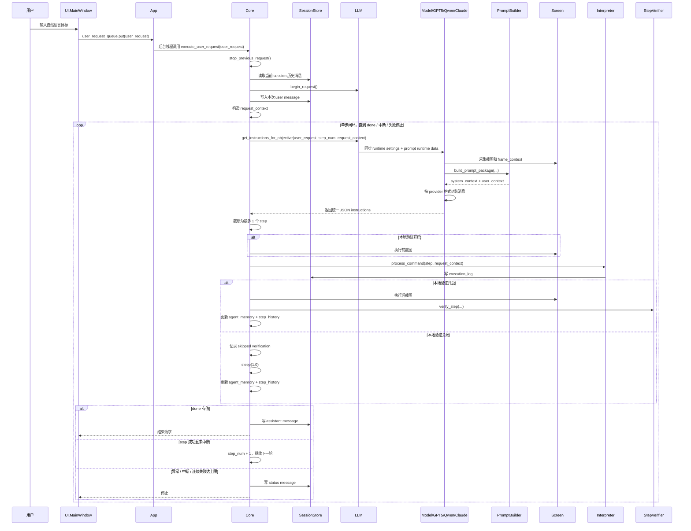

# Open Interface 请求链路与 Prompt System 调研

## 目的

本文基于当前仓库代码，说明两件事：

1. 从用户输入一句自然语言，到模型被调用、动作被执行、再进入下一轮的完整请求链路。
2. 在 Prompt System v1 重构后，模型现在到底收到了什么，以及各 provider 如何共享同一份 prompt 语义。

本文描述的是当前实现，不是旧设计稿，也不是 README 的高层概述。

## 先说结论

- 当前系统仍然是“单步视觉代理闭环”，不是多步计划执行器。
- 每一轮模型最多只返回 1 个 step；运行时即使收到多步，也只执行第一个。
- Prompt 语义已经从“`context.txt + request_data JSON` 直塞”重构为统一 Prompt System v1。
- 当前稳定 prompt 由 `PromptSystemContext + PromptToolSchema` 组成；动态 prompt 由 5 个层次块组成：
  - `PromptSystemContext`
  - `PromptToolSchema`
  - `PromptTaskContext`
  - `PromptExecutionTimeline`
  - `PromptRecentDetails`
  - `PromptVisualContext`
  - `PromptOutputContract`
- `system_context` 现在只保留稳定规则，不再混入动态步骤、截图细节、历史状态。
- 工具契约现在不再是散乱文本，而是由注册式 `ToolRegistry` 统一导出成 `PromptToolSchema`。
- 动态状态全部来自 `request_context`，并在每轮请求时由统一 `PromptBuilder` 组装。
- 全量步骤现在以 `step_history` 的形式在单次请求内持续累积，并以“一步一行摘要”的方式进入 prompt。
- 最近少量步骤会额外保留更详细的信息，帮助模型做下一步判断。
- 历史会话不再直接和当前请求拼成一个大字符串发给模型主链路；现在是结构化 `session_history_snapshot`。
- `OpenAI / GPT5`、`Qwen`、`Claude`、`GPT4v`、`GPT4o` 现在共享同一份 prompt 语义来源；provider 只负责消息格式封装。
- `computer-use-preview` 仍然是特殊路径，它走真 `tools`，不是这套“统一 JSON step 输出”的主路径。
- Prompt dump 现在支持落盘调试，开关为 `advanced.save_prompt_text_dumps`，默认关闭；开启后会把最终文本写到项目根目录 `promptdump/`。

## 一、当前请求链路总览

### 1.1 高层时序图



### 1.2 主链路的关键对象

#### `request_context`

当前一次请求的运行态核心载体在 `app/core.py` 里构造，关键字段包括：

- `prompt`: 当前顶层目标文本；现在就是用户原始请求，不再拼历史大段文本。
- `request_id`: 本次请求 ID。
- `request_token`: 本次请求的中断令牌。
- `session_id`: 当前会话 ID。
- `user_request`: 用户原始输入。
- `user_message_id`: 当前 user message 在数据库中的消息 ID。
- `next_step_index`: 即将执行的步骤编号，从 1 开始。
- `agent_memory`: 闭环压缩记忆，包含 recent actions / failures / unreliable anchors。
- `step_history`: 当前这次请求内已经走过的完整步骤历史。
- `session_history_snapshot`: 在本次请求开始时拍下的结构化历史消息摘要。
- `request_origin`: 顶层请求边界，例如 `new_request`、`retry_last_request`。

这里最重要的变化是：

- `session_history_snapshot` 负责 narrative history。
- `step_history` 负责当前请求内 authoritative state。

这两者不再混成一个大 prompt 字符串。

## 二、请求从 UI 到 Core 的完整流程

### 2.1 用户输入进入系统

UI 层只做三件事：

1. 从输入框读取用户自然语言目标。
2. 更新界面运行状态。
3. 把字符串放入 `user_request_queue`。

这一层不做 prompt 拼装，不做模型调用，也不做历史注入。

### 2.2 App 转发请求到 Core

`App` 持续监听 UI 队列：

- 普通字符串：启动后台线程调用 `Core.execute_user_request(...)`
- 控制消息：走停止、重试、切 session、热加载配置等分支

### 2.3 Core 构造本次请求上下文

`Core.execute_user_request()` 的关键动作：

1. 停止上一个请求。
2. 生成新的 `request_token`。
3. 读取当前 session 历史消息。
4. 调 `LLM.begin_request()`，让 stateful provider 有机会重置自己的内部状态。
5. 持久化当前 user message。
6. 构造 `request_context`。

这里有一个关键边界：

- `session_history_snapshot` 是在当前 user message 写入前，根据旧消息列表构建的。
- 当前用户目标单独作为 `Task Objective` 进入 prompt。

因此当前请求不会被重复塞进历史摘要里。

## 三、Prompt System v1 的分层结构

Prompt 组装的唯一入口在 `app/prompting/builder.py`。

它会生成一个 `PromptPackage`，里面至少包含：

- `schema_version`
- `system_context`
- `task_context`
- `execution_timeline`
- `recent_details`
- `visual_context`
- `output_contract`
- `user_context`
- `debug_text`

### 3.1 `PromptSystemContext`

来源：

- `app/resources/context.txt`
- `app/prompting/tool_schema.py`
- 设置中的 `advanced.custom_llm_instructions`
- `PROMPT_SCHEMA_VERSION = "v1"`

这一层只保留稳定规则：

- 角色定义
- 工具策略入口
- 坐标契约
- 单步策略
- 输出必须是 JSON
- 安全 / 登录 / 停止规则
- 语言策略

这一层不再包含：

- 当前步骤
- 历史步骤
- 当前屏幕尺寸等动态状态
- 当前失败轨迹

### 3.1.1 `PromptToolSchema`

来源：`app/prompting/tool_schema.py`

这是当前稳定工具契约的真正来源。

它不是一段手写的自由文本，而是由注册式工具系统统一生成：

- `ToolParameterDefinition`
- `ToolDefinition`
- `ToolRegistry`

当前 `build_system_context()` 会自动把 `build_tool_schema_text()` 生成的结果拼进 `PromptSystemContext`。

每个工具在注册表里声明：

- `name`
- `description`
- `parameters`
- `usage_rules`

因此模型现在看到的是一份明确的“允许函数 + 允许参数”清单，而不是一句“你可以调用某种风格的动作”。

当前默认注册的工具包括：

- `click`
- `moveTo`
- `dragTo`
- `write`
- `press`
- `scroll`
- `sleep`

当前坐标类工具的关键契约是：

- 模型返回的 `x_percent` / `y_percent` 是与截图标尺一致的 `0-100` 数值
- 运行时收到后会在本地除以 `100`，再映射到真实屏幕像素
- 这让模型看到的标尺和它输出的数值保持同一语义，不需要模型自己再换算

关键边界：

- 模型只能使用 `PromptToolSchema` 中注册过的函数名
- 模型不能发明未声明的参数名
- 工具 schema 不再向模型暴露底层实现细节

这意味着后续新增工具时，只需要：

1. 在 `ToolRegistry` 里注册一个新的 `ToolDefinition`
2. 如有需要，在运行时实现该工具的执行逻辑
3. prompt 会自动把新工具暴露给模型

### 3.2 `PromptTaskContext`

来源：`app/prompting/task_context.py`

它显式表达 authoritative state，包括：

- `Task Objective`
- `Top Level Request Origin`
- `Request Boundary`
- `Current Iteration`
- `Current Phase`
- `Last Step Result`
- `Current Blocker Or Risk`
- `Next Step Constraints`
- `Session Summary`
- `Machine Profile`

其中：

- `Session Summary` 来自 `session_history_snapshot`
- `Current Blocker Or Risk` 优先读最近一步的执行失败或验证失败
- `Next Step Constraints` 会综合 `agent_memory` 中的不可靠 anchor 和最近失败摘要

### 3.3 `PromptExecutionTimeline`

来源：`app/prompting/execution_timeline.py`

这一层会把当前请求内的完整 `step_history` 全量保留，但每步压缩成一行：

```text
- Step 8: click {"target_anchor_id": 7} | execution=failed | verification=not_run | reason=button target no longer exists
```

每一步最少包含：

- `step_index`
- `function`
- 压缩后的 `parameters`
- `execution_status`
- `verification_status`
- `reason`

这就是“全量步数保留，但细节压缩”的核心做法。

### 3.4 `PromptRecentDetails`

来源：`app/prompting/recent_details.py`

当前会保留最近 3 步详细信息，字段比 timeline 更丰富，包括：

- `function`
- `parameters`
- `justification`
- `expected_outcome`
- `execution_status`
- `verification_status`
- `verification_reason`
- `error_message`

这样做的目的不是重放全文日志，而是让模型更容易判断“下一步该怎么修正”。

### 3.5 `PromptVisualContext`

来源：`app/prompting/visual_context.py`

当前会明确告诉模型：

- 最新截图是单独附带的 image block
- `Logical Screen Size`
- `Capture Size`
- `Grid Reference`
- `Screen State`
- `Grid Usage Rule`

这一层强调的是视觉契约，而不是把图片信息藏在 JSON 里。

当前 `Grid Usage Rule` 的真实含义是：

- 看图上的顶端和左侧标尺
- 直接返回同一套 `0-100` 标尺值
- 不要让模型自行把标尺值除以 `100`

### 3.6 `PromptOutputContract`

来源：`app/prompting/output_contract.py`

统一输出协议现在明确要求：

- 顶层只允许 `steps` 和 `done`
- `steps` 最多 1 个可执行动作
- 每个 step 必须包含：
  - `function`
  - `parameters`
  - `human_readable_justification`
  - `expected_outcome`
- `done` 在完成前必须为 `null`
- 完成、阻塞或不安全时，返回 `steps: []` 和非空 `done`

对于坐标类动作，当前示例坐标已经使用 `0-100` 标尺，例如：

```json
{
  "function": "click",
  "parameters": {
    "x_percent": 31.5,
    "y_percent": 44.2,
    "button": "left",
    "clicks": 1
  }
}
```

也就是说，provider 不再各自定义小变体。

## 四、真正发给模型的内容现在是什么

### 4.1 不再是旧的 `context.txt + request_data JSON`

旧主路径里，模型常收到：

- 一整块 `context.txt`
- 一整坨 `request_data JSON`
- 再附一张图

现在主路径已经改成：

- 一份稳定的 `system_context`
- 一份注册表导出的 `PromptToolSchema`
- 一份分层的 `user_context`
- 一张单独附带的截图

`user_context` 是结构化文本，不再是“把运行态 JSON 粘到底部”那种形式。

### 4.2 `GPT5` 路径的消息形状

当前 `app/models/gpt5.py` 会发送两段内容：

```json
[
  {
    "role": "system",
    "content": [
      {
        "type": "input_text",
        "text": "<PromptSystemContext + PromptToolSchema>"
      }
    ]
  },
  {
    "role": "user",
    "content": [
      {
        "type": "input_text",
        "text": "<PromptSchema + PromptTaskContext + PromptExecutionTimeline + PromptRecentDetails + PromptVisualContext + PromptOutputContract>"
      },
      {
        "type": "input_image",
        "image_url": "data:image/png;base64,..."
      }
    ]
  }
]
```

### 4.3 `Qwen` 路径的消息形状

`Qwen` 现在也从同一个 `PromptPackage` 取内容，只是走 OpenAI-compatible chat completion：

```json
[
  {
    "role": "system",
    "content": "<PromptSystemContext + PromptToolSchema>"
  },
  {
    "role": "user",
    "content": [
      {"type": "text", "text": "<PromptUserContext>"},
      {"type": "image_url", "image_url": {"url": "data:image/png;base64,..."}}
    ]
  }
]
```

### 4.4 `Claude` 路径的消息形状

`Claude` 现在同样共享 builder 语义，只是 Anthropic 兼容接口要求把 `system` 单独传：

```json
{
  "system": "<PromptSystemContext + PromptToolSchema>",
  "messages": [
    {
      "role": "user",
      "content": [
        {"type": "text", "text": "<PromptUserContext>"},
        {"type": "image", "source": {"type": "base64", "media_type": "image/png", "data": "..."}}
      ]
    }
  ]
}
```

### 4.5 `GPT4v` / `GPT4o` 路径

- `GPT4v` 已接入同一套 `PromptPackage`
- `GPT4o` 仍使用 assistant/thread 语义，但 user text 内容也来自同一个 `PromptPackage`

所以现在真正统一的是“prompt 语义来源”，不是“所有 provider 的 API 入参长得一样”。

## 五、历史、authoritative state 和闭环记忆怎么分工

这是这次重构里最重要的边界之一。

### 5.1 `session_history_snapshot`

作用：表达 narrative history。

特点：

- 来自当前 session 的历史 message
- 在请求开始时拍快照
- 递归续跑阶段复用同一份快照
- 不会在每轮重新生成和重复拼接

它回答的问题是：

- 这个任务从会话角度看，之前聊到了哪里？

### 5.2 `step_history`

作用：表达 authoritative runtime state。

特点：

- 只记录本次请求内已经执行过的步骤
- 每步保存执行结果和验证结果
- 每轮都会更新
- 是 `ExecutionTimeline` 和 `RecentDetails` 的唯一来源

它回答的问题是：

- 这次请求真正走到了哪一步？
- 最近哪里失败了？
- 当前最相关的卡点是什么？

### 5.3 `agent_memory`

作用：提供短摘要型闭环记忆。

包含：

- `recent_actions`
- `recent_failures`
- `unreliable_anchor_ids`
- `consecutive_verification_failures`

它不是完整历史，而是“下一步决策需要知道的压缩信号”。

## 六、为什么说现在做到了“全量步数保留但分层表达”

当前系统不再只给模型最近 6 步动作摘要。

新的策略是：

1. 当前请求内每个 step 都写入 `step_history`
2. `PromptExecutionTimeline` 对全部 step 做一行摘要
3. `PromptRecentDetails` 只保留最近 3 步细节

优先级是：

1. 先保完整步数
2. 再压缩单步摘要长度
3. 再限制 recent details 数量

这就避免了两种旧问题：

- 只有近几步，模型看不到完整过程
- 全量原始日志全塞进去，token 爆炸且失败噪音过重

## 七、动作执行、验证与纠偏

### 7.1 Interpreter 负责执行

当前解释器在底层仍然负责执行桌面动作，但模型侧已经不再通过“底层库名”理解能力，而是通过 `PromptToolSchema` 理解可用工具。

当前稳定暴露给模型的动作能力由工具注册表决定，解释器负责把这些工具映射到本地执行。

重要点：

- 模型看到的是注册过的工具名和参数签名
- 解释器负责把这些工具名映射成实际执行行为
- 如果 prompt 允许的工具和解释器支持的工具发生漂移，就可能再次出现执行失败

当前执行层的几个事实仍然成立：

- 坐标动作优先使用 `x_percent / y_percent`
- 模型返回的是与可见标尺一致的 `0-100` 数值，解释器在本地再除以 `100`
- `write` 对非 ASCII 文本会自动走剪贴板粘贴
- 每次执行结果仍会写入 `execution_logs`

### 7.2 Verifier 负责本地验证

当 `runtime.disable_local_step_verification = false` 时：

1. 执行前截图
2. 执行动作
3. 执行后截图
4. `StepVerifier.verify_step(...)`
5. 把结果写入 `agent_memory` 和 `step_history`

如果验证失败：

- 当前失败会进入 `Current Blocker Or Risk`
- 最近失败会进入 `Next Step Constraints`
- 不可靠 anchor 会被标记
- 连续失败达到上限会停止

### 7.3 跳过本地验证模式

当 `runtime.disable_local_step_verification = true` 时：

- 不做本地截图差分验证
- 本轮会记成 `verification_status = skipped`
- `verification_reason = local_step_verification_disabled`
- 执行成功后固定等待 `1.0` 秒
- 若 `done` 仍为空，就进入下一轮重新观察屏幕

注意这不是关闭闭环，而是关闭“本地差分验证”这一步。

## 八、停止、重试和请求边界

### 8.1 单步执行强约束

无论模型返回多少步：

- 运行时都只取第一个 step 执行

因此系统架构仍然是“严格单步”。

### 8.2 `done` 的意义

当模型返回：

```json
{
  "steps": [],
  "done": "..."
}
```

表示：

- 任务已完成
- 或者任务应该安全停止
- 或者任务被登录、2FA、captcha 等人工边界阻塞

### 8.3 中断逻辑

用户点击 Stop 后：

- 当前 `request_token` 被标记为取消
- 后续返回的模型结果会被丢弃
- 不再执行后续动作
- 不再进入下一轮递归

这一点在 prompt 重构后没有变化。

### 8.4 顶层请求边界

当前系统显式区分：

- `Top Level Request Origin`: 顶层请求来自哪里，例如 `new_request` 或 `retry_last_request`
- `Request Boundary`: 当前轮次是顶层起点还是 `continuation`

也就是说，模型现在能分清：

- 这是一个新请求
- 这是一个重试请求
- 这是同一请求里的续跑轮次

## 九、Prompt dump 调试能力

这是这次重构新增的关键调试能力。

### 9.1 开关

配置项：

- `advanced.save_prompt_text_dumps`

特点：

- 默认 `false`
- 持久化在 sqlite settings 里

### 9.2 落盘位置

开启后，最终 prompt 文本会写到项目根目录：

- `promptdump/`

文件命名会带：

- 时间戳
- `request_id`
- `step_num`

### 9.3 落盘内容

当前保存的是：

- `system_context`
- `user_context`

也就是最终真正发给模型的文本语义内容。

它不包含：

- API Key
- provider 认证头
- 图片二进制数据

## 十、`computer-use-preview` 为什么仍然是例外

`app/models/openai_computer_use.py` 仍然是一条特殊分支：

- 它通过 OpenAI Responses API 的 `computer_use_preview` 真工具走 GUI action
- 返回结构最终仍会被标准化成 `steps / done`
- 但它不是这次 Prompt System v1 的主 provider 包装路径

所以你可以把当前系统分成两类：

1. 主路径：统一 prompt builder + provider 消息封装 + JSON step 输出
2. 特殊路径：`computer-use-preview` 真工具模式

## 十一、关键源码索引

建议按这个顺序读：

1. `app/core.py` - 请求上下文、递归闭环、验证、停止逻辑
2. `app/llm.py` - 运行时配置同步、稳定 system context 生成
3. `app/models/model.py` - 统一 provider 抽象与 `execute_prompt_round()`
4. `app/prompting/builder.py` - 统一 PromptPackage 生成入口
5. `app/prompting/tool_schema.py` - 注册式工具定义和 Tool Schema 输出
6. `app/prompting/task_context.py` - authoritative state 如何表达
7. `app/prompting/execution_timeline.py` - 完整 timeline 如何压缩
8. `app/prompting/recent_details.py` - 最近细节如何保留
9. `app/prompting/visual_context.py` - 视觉上下文如何表达
10. `app/prompting/output_contract.py` - 统一输出协议
11. `app/prompting/debug.py` - prompt dump 如何落盘
12. `app/models/gpt5.py` - GPT5 的 message 封装
13. `app/models/qwen.py` - Qwen 的 message 封装
14. `app/models/claude.py` - Claude 的 message 封装
15. `app/interpreter.py` - step 如何变成实际鼠标键盘动作
16. `app/verifier.py` - 本地截图差分验证

## 十二、一句话总结

如果你现在输入一句请求，系统已经不再把“`context.txt + 原始 request_data JSON`”粗暴贴给模型，而是先在 `Core` 里建立结构化 `request_context`，再由统一 `PromptBuilder` 生成分层的 Prompt System v1 文本，并由注册式 `ToolRegistry` 自动导出稳定的 `PromptToolSchema` 给模型；各 provider 只负责封装同一份 prompt 语义，运行时依旧保持单步执行、截图重观察、本地验证可开关、失败可纠偏、中断可立即终止的闭环架构。
